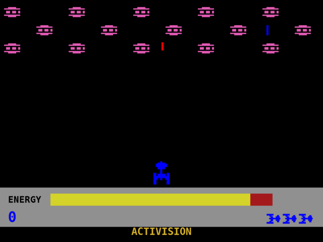
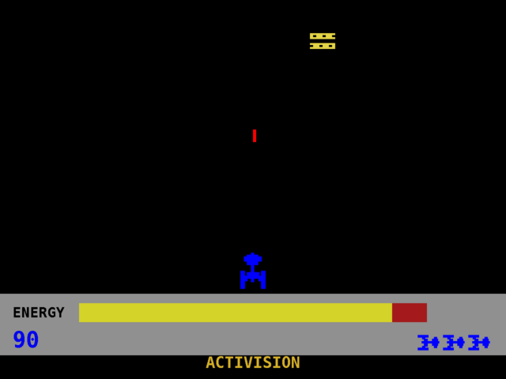
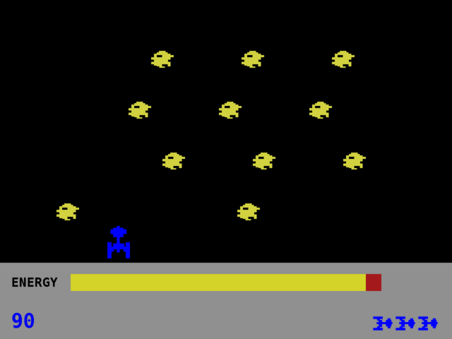

# JMegamania

A Java port of the Atari 2600 game **Megamania**, built with Swing/Java2D.
Created for learning purposes and licensed under the GNU GPL (see `LICENSE`).

## Screenshots

| Wave 1 — hamburgers | Wave 2 — cookies | Wave 8 — space dice |
|---|---|---|
|  |  |  |

## Requirements
- Java 17+
- Maven

Runs on both Windows and Linux.

## Running

```bash
./run.sh          # Linux / macOS
run.bat           # Windows
```

The scripts build the project and launch the game. To build manually:

```bash
mvn -q package -DskipTests
java -jar target/jmegamania.jar
```

## Gameplay

The wave, formation, movement, and firing logic is reimplemented from the
original ROM (see the disassembly under References):

- Eight attack waves cycle endlessly: hamburgers, cookies, bugs, radial tires,
  diamonds, steam irons, bow ties and space dice.
- Horizontal waves (hamburgers, bugs, diamonds, bow ties) are a 5x3 grid,
  uniformly spaced around the wrapping MegaSphere with the middle row
  staggered by half a column, sweeping rightward and popping into view one
  object every 16 frames. (The ROM tracks 16 pattern bits, but the middle
  row's sixth sprite copy wraps exactly onto its first slot and lives and dies
  with it, so there are 15 effective targets.) The whole
  formation bobs vertically in a triangle wave at each wave's own ROM rate:
  hamburgers barely move, bugs take ~34 s per cycle, diamonds ~17 s, and bow
  ties bounce every ~2 s. From the second loop every horizontal wave follows
  the ROM's 256-frame rhythm: 80 frames frozen, 48 at double speed, 128 normal.
- Vertical waves (cookies, tires, irons, dice) are six rows of three that
  slide smoothly down the screen at the ROM's descent-timer rate (with its
  characteristic creep-and-pause bursts on the first loop), the bottom row
  recycling to the top at a random column. Cookies zigzag in unison, tires
  alternate row
  directions, dice fall straight (drifting diagonally from the second loop),
  and steam irons jitter randomly inside a fixed horizontal band. Descending
  objects can ram the blaster; horizontal waves never reach it. Descent speeds
  up on later loops, and the third loop shrinks cookie (and wave-24 dice) rows
  to two objects.
- Enemy fire uses the hardware's missile slots: at most two shots in flight on
  horizontal waves (one per cluster side), one on vertical waves (fired by the
  second row from the top). Dice never fire. Shots fall faster from the third
  loop.
- First loop scoring: 20/30/40/50/60/70/80/90 points per object by wave; from
  the second loop on, every object is worth 90.
- The energy bar uses the ROM's exact timing: 83 units, draining one unit every
  32 frames (a full bar lasts about 44 seconds), shown in 20 chunks of four
  units. Running dry costs a blaster. When a wave is cleared, each remaining
  energy unit pays the cleared wave's point value as a bonus while the next
  wave waits, staged out of sight behind the left-edge blank strip (the
  Atari's per-scanline HMOVE bar, reproduced here), then walks out from
  behind it as play resumes.
- You start with three reserve blasters and earn another every 10,000 points,
  up to six in reserve. The death scene is the ROM's 31-step color ramp — the
  ship brightens through grays into a white/blue flicker, then fades out.
- Missiles are guided: they follow the blaster's horizontal movement (game 1
  of the original). In the guided games the ROM resets its fire debounce
  every frame, so holding fire streams shots continuously. The blaster stops
  short of the screen edges exactly where the ROM clamps it.

Controls: arrow keys to move, space to fire, Enter to restart after game over,
F11 to toggle fullscreen.

## Development

See [AGENTS.md](AGENTS.md) for project layout, build/test commands, and coding conventions.

Dev aid: `java -Djmegamania.wave=N -jar target/jmegamania.jar` starts at
absolute wave N (0-7 is the first loop; 8+ reaches the later, harder loops).

## References

- [MegaMania disassembly by Dennis Debro](https://github.com/DNSDEBRO/Disassemblies/tree/main/Atari2600/MegaMania) —
  reverse-engineered 6502 source of the original ROM, used for exact gameplay
  values (energy timing, enemy sizes, spacing, speeds, scoring)
- https://github.com/PhelipeScript/megamania
- https://github.com/zuppao/megamania
